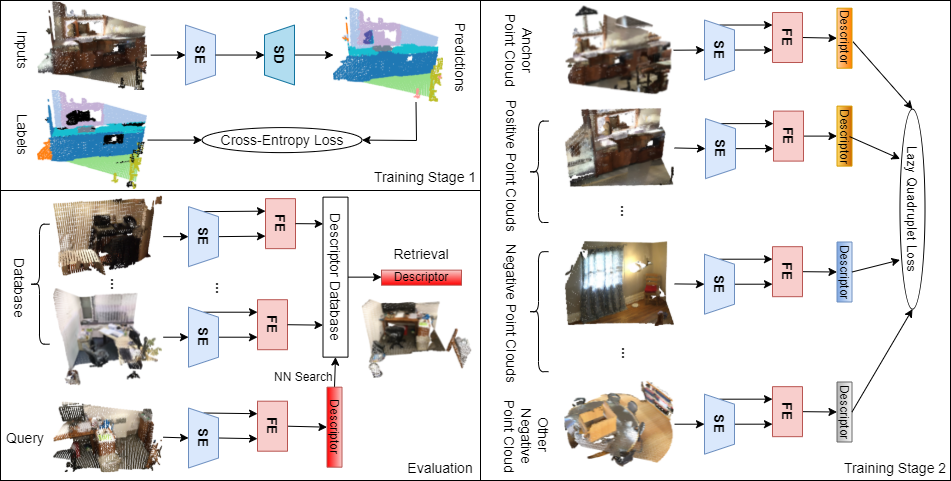

# Semantic Indoor Place Recognition

Repo will be cleaned up soon.



## Introduction

This repository contains the implementation of **CGiS-Net** in [PyTorch](https://pytorch.org/).
 
CGiS-Net is an indoor place recognitino network presented in our IROS 2022 paper ([arXiv](https://arxiv.org/abs/2202.02070)). If you find our work useful in your research, please consider citing:

```
@inproceedings{ming2022CGiSNet,
    author = {Ming, Yuhang and Yang, Xingrui and Zhang, Guofeng and Calway, Andrew},
    title = {CGiS-Net: Aggregating Colour, Geometry and Implicit Semantic Features for Indoor Place Recognition}
    booktitle = {IEEE/RSJ International Conference on Intelligent Robots and Systems (IROS)},
    Year = {2022}
}
```

## Installation

This implementation has been tested on Ubuntu 18.04 and 20.04. 

* For Ubuntu 18.04 installation, please see the instructions from the official KP-Conv repository [INSTALL.md](https://github.com/HuguesTHOMAS/KPConv-PyTorch/blob/master/INSTALL.md).

* For Ubuntu 20.04 installation, the procedure is basically the same except for different versions of packages are used.

    - PyTorch 1.8.0, torchvision 0.9.0, CUDA 11.1, cuDNN 8.6.0

## Experiments

### Data

The ScanNetPR dataset can be downloaded [here](https://drive.google.com/drive/folders/1F3jJ_iPJIMIl4Fr06ioVQq8fCVqqMDnP?usp=sharing)
```
├── ScanNetPR
│   ├── scans                              # folder to hold all the data
│   │   ├── scene0000_00
│   │   │   ├── input_pcd_0mean
│   │   │   │   ├── scene0000_00_0_sub.ply # zero meaned point cloud file stored ad [x, y, z, r, g, b]
│   │   │   │   ├── ...
│   │   │   ├── pose
│   │   │   │   ├── 0.txt                  # pose corresponding to the point cloud
│   │   │   │   ├── ...
│   │   │   ├── scene0000_00.txt           # scene information
│   │   ├── ...
│   ├── views/Tasks/Benchmark              # stores all the data split file from ScanNet dataset
│   ├── VLAD_triplets                      # stores all the files necessary for generating training tuples
├── batch_limits.pkl                       # calibration file for KP-Conv
├── max_in_limits.pkl                      # calibration file for KP-Conv
├── neighbors_limits.pkl                   # calibration file for KP-Conv
└── other ScanNet related files ...
```

### Training stage 1:

In the first stage we train the semantic encodes and decoder on a SLAM-Segmentation task, i.e. semantic segmentation on coloured point clouds within local coordinate system.

1. Change the `self.path` variable in the `datasets/ScannetSLAM.py` file to the path of complete ScanNet dataset.

2. Run the following to train the semantic encoder and decoder.
```
python train_ScannetSLAM.py
```

The training usually takes a day. We also provide our pretrained endocer-decoder [here](https://drive.google.com/drive/folders/1ClyEa7fygBkKZ5oEH-DQQYykj8RJJ51p?usp=sharing) if you want to skip the first training stage.

Please download the folder and put it in the `results` directory. In the folder `Log_2021-06-16_02-31-04` we provide the model trained on the complete ScanNet dataset WITHOUT colour. And in the folder `Log_2021-06-16_02-42-30` we provide the model trained on the compltete ScanNet dataset WITH colour.

### Training stage 2:

In the second stage, we train the feature embedding module to generate the global descriptors.

1. Change the `self.path` variable in the `datasets/ScannetTriple.py` file to the path of ScanNetPR dataset.

2. Run the the training file as:
```
python feature_embedding_main.py --train --num_feat 5 --optimiser Adam
```
Train the model with different setting:
- change the number of feature layers by choosing --num_feat from [3, 5];
- change the optimiser by choosing --optimiser from [SGD, Adam];
- set to use point clouds without colour by setting the an optional flag --no_color.

### Evaluation:
Run the file with an additional --test flag on, perform evaluation with the --eval flag on:
```
python feature_embedding_main.py --test --num_feat 5 --optimiser Adam --eval
```

### Visualisations
* [Kernel Visualization](./doc/visualization_guide.md): Use the script from KP-Conv repository, the kernel deformations can be displayed.

### Results

Our CGiS-Net is compared to a traditional baseline using SIFT+BoW, and 4 deep learning based method [NetVLAD](https://github.com/Nanne/pytorch-NetVlad), [PointNetVLAD](https://github.com/cattaneod/PointNetVlad-Pytorch), [MinkLoc3D](https://github.com/jac99/MinkLoc3D) and Indoor DH3D.

|   |Recall@1|Recall@2|Recall@3|
|---|---|---|---|
| SIFT+BoW  | 16.16  | 21.17  | 24.38  |
| NetVLAD  | 21.77  | 33.81  | 41.49  |
| PointNetVLAD  | 5.31  | 7.50  | 9.99  |
| MinkLoc3D  | 3.32  | 5.81  | 8.27  |
| Indoor DH3D  | 16.10  | 21.92  | 25.30  |
| CGiS-Net (Ours)  | 61.12  | 70.23  | 75.06  |


## Acknowledgment

In this project, we use parts of the official implementations of following works:

* <a href="https://github.com/HuguesTHOMAS/KPConv-PyTorch">KP-FCNN</a> (Semantic Encoder-Decoder)

* <a href="https://github.com/cattaneod/PointNetVlad-Pytorch">PointNetVLAD-Pytorch</a> (NetVLAD Layer)

## Future Work
- [ ] Test on NAVER Indoor Localisation Dataset [Link](https://europe.naverlabs.com/blog/first-of-a-kind-large-scale-localization-datasets-in-crowded-indoor-spaces/).

- [ ] Test on other outdoor datasets (Oxford RobotCar Dataset etc.).

- [ ] Explore attention module for better feature selection before constructing global descriptors.
